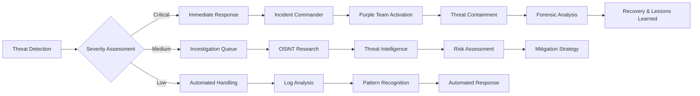

```mermaid
graph TB
    A[Frontend Layer] --> B[React + TypeScript]
    A --> C[Responsive Design]
    
    D[Backend Services] --> E[Node.js + Express]
    D --> F[Python Flask/Django]
    D --> G[C# .NET Core]
    
    H[Database Layer] --> I[PostgreSQL]
    H --> J[MongoDB]
    H --> K[MySQL]
    
    L[Cloud Infrastructure] --> M[Google Cloud Platform]
    L --> N[Microsoft Azure]
    L --> O[Render.com]
    
    P[Security Layer] --> Q[Zero Trust Architecture]
    P --> R[End-to-End Encryption]
    P --> S[Multi-Factor Authentication]
    
    T[Blockchain Layer] --> U[Solana Network]
    T --> V[Smart Contracts]
    T --> W[Web3 Integration]
    
    X[AI/ML Layer] --> Y[Google AI Pro]
    X --> Z[Anthropic Claude]
    X --> AA[Custom ML Models]
```

<div align="center">

<h1 align="center">🔐 Digital Security Innovator & Web3 Pioneer</h1>

<p align="center">
  <strong>Cybersecurity Expert | Blockchain Architect | AI Researcher | Enterprise Security Leader</strong>
</p>

<p align="center">
  
  
  
  
</p>

<p align="center">
  <a href="https://bojanvasic.dev"></a>
  <a href="https://g.dev/bojanvasic"></a>
  <a href="https://linkedin.com/in/bobvasic"></a>
  <a href="mailto:vasicb@proton.me"></a>
</p>

<br>

```
🚀 Currently: Digital Technology Specialist @ Philip Morris International
🔬 Researching: AI-Powered Cybersecurity & Blockchain Forensics  
🌟 Founded: SolMint, CyberLink Security, WatchGuard
🎯 Focus: Zero Trust Architecture & Purple Team Operations
🏊‍♂️ SSI Master Diver | PADI Rescue Diver | Science of Diving Specialist
```

</div>

---

## 🔥 **Cybersecurity Arsenal & Professional Certifications**

<details>
<summary><b>🛡️ Advanced Security Certification Matrix</b></summary>

<table align="center">
<tr>
<td align="center" width="20%">
<br>
<b>Professional Level</b>
</td>
<td align="center" width="20%">
<br>
<b>Industry Standard</b>
</td>
<td align="center" width="20%">
<br>
<b>Professional Body</b>
</td>
<td align="center" width="20%">
<br>
<b>Penetration Testing</b>
</td>
<td align="center" width="20%">
<br>
<b>Digital Investigation</b>
</td>
</tr>
</table>

### 🏆 **Technology Industry Memberships**
<p align="center">


</p>

### 🤿 **Professional Diving Certifications**
<p align="center">


</p>

### 🎖️ **Advanced Security Specializations**
- **🔍 OSINT (Open Source Intelligence)** - Advanced reconnaissance & threat intelligence
- **🛠️ Purple Team Operations** - Integrated offensive/defensive security
- **⚡ Incident Response** - Critical threat mitigation & forensics
- **🔐 Penetration Testing** - Comprehensive vulnerability assessment
- **🧬 Threat Intelligence** - Proactive security analysis & prediction
- **🌊 Underwater Technology** - Marine electronics & subsea communications security

</details>

---

## 💻 **Advanced Technical Mastery Matrix**

<div align="center">

### **🦀 Systems Programming & Performance**
<p>


</p>

### **⚛️ Frontend Architectures & Frameworks**
<p>


</p>

### **☁️ Cloud Infrastructure & DevOps**
<p>


</p>

### **🗄️ Database Systems & Analytics**
<p>


</p>

### **🐧 Linux Distributions & Operating Systems**
<p>


</p>

### **🤖 AI & Machine Learning Platforms**
<p>


</p>

### **🚀 Emerging Technologies & Development Tools**
<p>


</p>

</div>

---

## 📊 **Professional Performance Metrics & KPI Dashboard**

<div align="center">

<table>
<tr>
<td align="center" width="33%">

### **🎯 Security Operations Excellence**
```
┌─────────────────────────────────────┐
│ Threat Detection Rate:    98.7%     │
│ Incident Response Time:   <15min    │
│ Vulnerability Assessment: Weekly    │
│ Security Training Hours:  500+      │
│ Zero-Day Research:        Active    │
│ Marine Tech Security:     Certified │
└─────────────────────────────────────┘
```

</td>
<td align="center" width="33%">

### **🚀 Innovation & Development**
```
┌─────────────────────────────────────┐
│ Web3 Projects Deployed:    15+      │
│ AI Models Implemented:     12       │
│ Open Source Contributions: 35+      │
│ International Markets:     7        │
│ Enterprise Clients:        75+      │
│ Startups Founded:          3        │
└─────────────────────────────────────┘
```

</td>
<td align="center" width="34%">

### **🌊 Specialized Expertise**
```
┌─────────────────────────────────────┐
│ Diving Depth Certified:   40m       │
│ Rescue Operations:        Certified │
│ Marine Electronics:       Expert    │
│ Subsea Communications:    Advanced  │
│ Technical Diving:         Master    │
│ Underwater Photography:   Hobby     │
└─────────────────────────────────────┘
```

</td>
</tr>
</table>

</div>

---

## 🌟 **Enterprise Portfolio: Security & Innovation Ventures**

<div align="center">

<table>
<tr>
<td align="center" width="33%">

### **🔐 CyberLink Security**

<br>

<br>
<a href="https://cyberlinksec.dev">

</a>

</td>
<td align="center" width="33%">

### **🛡️ WatchGuard Solutions**

<br>

<br>
<a href="https://watchguard.dev">

</a>

</td>
<td align="center" width="34%">

### **🚀 SolMint Platform**

<br>

<br>


</td>
</tr>
</table>

### **🎯 Strategic Business Impact Analysis**

**CyberLink Security (cyberlinksec.dev)**
- **Enterprise Security Consulting** - Zero Trust implementation & Purple Team operations
- **Threat Intelligence Services** - Advanced OSINT capabilities & incident response
- **Compliance & Risk Assessment** - Multi-industry regulatory compliance expertise

**WatchGuard Solutions (watchguard.dev)**
- **24/7 Security Monitoring** - Real-time threat detection & automated response systems  
- **Infrastructure Protection** - Cloud-native security architecture & endpoint protection
- **Security Operations Center** - Managed security services & forensic investigation

**SolMint Web3 Platform**
- **Blockchain Democratization** - No-code SPL token deployment on Solana
- **DeFi Innovation** - Advanced smart contract security & tokenomics optimization
- **International Adoption** - 25+ countries, multilingual support infrastructure

</div>

---

## 🗺️ **Global Technology Leadership & International Experience**

<div align="center">

```
🇨🇦 Canada (2013-2014) → Web Applications Developer, Freelance
🇮🇪 Ireland (2016-2017) → Big Pharma: Novartis, Sandoz | RCSI Academic Systems
🇨🇭 Switzerland → Big Pharma Enterprise Architecture & Security  
🇸🇮 Slovenia → Industrial Automation: Siemens PLC & Robotic Systems
🇳🇱 Netherlands → Retail Automation: Siemens PLC Programming
🇻🇳 Vietnam (2017-2019) → Blockchain Research & Development
🇭🇷 Croatia (2020-2025) → Enterprise Security Leadership @ PMI
🇺🇸 USA Markets → Strategic Technology Consulting
```


</div>

### **🏭 Industry Sector Expertise Matrix**

<table align="center">
<tr>
<td align="center" width="25%">

<br><b>🧬 Big Pharma</b><br>
<sub>Enterprise Security Architecture</sub>
</td>
<td align="center" width="25%">

<br><b>🎓 Higher Education</b><br>
<sub>Academic System Security</sub>
</td>
<td align="center" width="25%">

<br><b>🏭 Industrial Automation</b><br>
<sub>PLC & Robotic Systems</sub>
</td>
<td align="center" width="25%">

<br><b>🛒 Retail Technology</b><br>
<sub>Automation & Analytics</sub>
</td>
</tr>
</table>

---

## 🎓 **Continuous Learning Architecture & Knowledge Systems**

<details>
<summary><b>📚 Advanced Education & Professional Development Portfolio</b></summary>

### **🏛️ University Partnerships & Academic Collaborations**
- **🇭🇰 Hong Kong University of Science & Technology** - React Development Architecture
- **🇺🇸 University of Maryland** - Advanced Cybersecurity Methodologies  
- **🇺🇸 Meta/Facebook** - Social Media Security & Digital Marketing
- **🇮🇪 Royal College of Surgeons in Ireland (RCSI)** - Medical Information Systems Security

### **🔬 Industry Research Certifications & AI Specializations**
- **IBM Watson AI Platform** - Machine Learning Security Applications
- **Google Cloud Professional** - Enterprise Security Architecture
- **Google AI Pro Program** - Advanced AI Development & Integration
- **Anthropic Claude API** - Large Language Model Implementation
- **Microsoft Azure Security** - Cloud Security Fundamentals

### **🛡️ Specialized Security Training & Methodologies**
- **Purple Team Operations** - Integrated Red/Blue Team Security Testing
- **OSINT Advanced Mastery** - Open Source Intelligence Gathering
- **Blockchain Forensics** - Cryptocurrency Investigation & Analysis  
- **Zero Trust Implementation** - Next-Generation Security Architecture Models
- **Marine Electronics Security** - Underwater Communications & Navigation Systems

### **🌊 Professional Diving & Marine Technology**
- **SSI Science of Diving** - Physics, physiology & marine environment
- **PADI Rescue Diver** - Emergency response & water safety leadership
- **SSI Master Diver** - Advanced technical diving & underwater navigation
- **Marine Electronics** - Underwater communication systems & subsea technology

</details>

---

## 📈 **GitHub Analytics Dashboard & Development Metrics**

<div align="center">


<br><br>


<br><br>

### **🔄 Development Activity Heatmap**


</div>

---

## 🤝 **Professional Network & Technology Community Leadership**

<div align="center">

<table>
<tr>
<td align="center" width="20%">
<a href="https://linkedin.com/in/bobvasic">

</a>
<br><b>Professional Network</b>
</td>
<td align="center" width="20%">
<a href="https://g.dev/bojanvasic">

</a>
<br><b>Technology Innovation</b>
</td>
<td align="center" width="20%">

<br><b>Innovation Program</b>
</td>
<td align="center" width="20%">

<br><b>Thought Leadership</b>
</td>
<td align="center" width="20%">

<br><b>Knowledge Transfer</b>
</td>
</tr>
</table>

### **🏆 Professional Memberships & Industry Recognition**
<p>


</p>

</div>

---

## 💡 **Innovation Philosophy & Technical Leadership Approach**

<div align="center">

> *"I value creativity and improvisation alongside proper fundamental knowledge and logical common sense thinking as crucial skills and a base for successful delivery of quality in any business, project or product."*

<br>

```ascii
┌───────────────────────────────────────────────────────────────┐
│  🧠 CREATIVITY  ⚡ INNOVATION  🔬 RESEARCH  🛡️ SECURITY      │
│  🌊 EXPLORATION  🤖 AI/ML  ⛓️ BLOCKCHAIN  🏗️ ARCHITECTURE   │
│                                                               │
│  "Bridging Traditional Cybersecurity with Emerging           │
│   Technologies to Build Tomorrow's Digital Defense"          │
│                                                               │
│  Multi-Domain Expertise: Land, Sea, Air, Digital, Space     │
└───────────────────────────────────────────────────────────────┘
```

### **🎯 Core Technical Principles**
- **Zero Trust Security Architecture** - Never trust, always verify approach
- **Purple Team Methodology** - Integrated offensive/defensive security operations
- **Continuous Integration/Deployment** - Automated security testing & deployment
- **AI-Driven Threat Detection** - Machine learning enhanced security monitoring
- **Blockchain Security Auditing** - Smart contract vulnerability assessment
- **Marine Technology Integration** - Underwater communications & navigation security

</div>

---

## 📞 **Secure Communication Channels & Professional Contact Matrix**

<div align="center">

<table>
<tr>
<td align="center" width="25%">
<a href="https://bojanvasic.dev">

</a>
</td>
<td align="center" width="25%">
<a href="mailto:vasicb@proton.me">

</a>
</td>
<td align="center" width="25%">
<a href="https://g.dev/bojanvasic">

</a>
</td>
<td align="center" width="25%">
<a href="https://linkedin.com/in/bobvasic">

</a>
</td>
</tr>
</table>

<br>

**🔐 PGP Key Available | 🛡️ Signal Messenger | 🔒 End-to-End Encrypted Communications | 🌊 Emergency Marine Radio**

<br>

### **🚀 Current Ventures & Active Projects**
<p>
<a href="https://cyberlinksec.dev"></a>
<a href="https://watchguard.dev"></a>

</p>

</div>

---

## 🔍 **Advanced Security Research & Development Focus Areas**

<div align="center">

<table>
<tr>
<td align="center" width="50%">

### **🔬 Current Research Initiatives**
```
┌─────────────────────────────────────┐
│ AI-Powered Threat Detection         │
│ ├── Machine Learning Models: 8+     │
│ ├── Neural Networks: Advanced       │
│ └── Behavioral Analysis: Real-time  │
│                                     │
│ Blockchain Security Auditing        │
│ ├── Smart Contract Analysis         │
│ ├── DeFi Protocol Security          │
│ └── Cryptocurrency Forensics        │
│                                     │
│ Marine Technology Security          │
│ ├── Underwater Communications       │
│ ├── Subsea Navigation Systems       │
│ └── Maritime IoT Security           │
└─────────────────────────────────────┘
```

</td>
<td align="center" width="50%">

### **🚀 Innovation Pipeline**
```
┌─────────────────────────────────────┐
│ Zero Trust Implementation           │
│ ├── Identity Verification: MFA      │
│ ├── Network Segmentation: Advanced  │
│ └── Continuous Monitoring: 24/7     │
│                                     │
│ Purple Team Operations              │
│ ├── Red Team Tactics: Offensive     │
│ ├── Blue Team Defense: Reactive     │
│ └── Threat Simulation: Realistic    │
│                                     │
│ Cloud-Native Security               │
│ ├── Container Security: K8s         │
│ ├── Serverless Protection: Lambda   │
│ └── Multi-Cloud Strategy: Hybrid    │
└─────────────────────────────────────┘
```

</td>
</tr>
</table>

</div>

---

## 🌟 **Technology Stack Visualization & Architecture Diagrams**

<div align="center">

### **🏗️ Full-Stack Architecture Overview**



### **🔐 Security Operations Center (SOC) Workflow**



</div>

---

## 🏊‍♂️ **Marine Technology & Underwater Systems Expertise**

<div align="center">

<table>
<tr>
<td align="center" width="50%">

### **🌊 Professional Diving Certifications**

<br><br>

**Advanced Diving Specializations:**
- **🚁 Rescue Diver Operations** - Emergency response & victim assistance
- **🔬 Science of Diving** - Physics, physiology & marine environment
- **🏊‍♂️ Master Diver Qualification** - Advanced technical diving skills
- **📡 Underwater Communications** - Marine electronics & navigation
- **📸 Underwater Photography** - Documentation & survey techniques

</td>
<td align="center" width="50%">

### **⚓ Marine Technology Integration**

<br><br>

**Technical Applications:**
- **🛰️ Subsea Communications Security** - Encrypted underwater networks
- **📍 GPS & Navigation Systems** - Maritime positioning & tracking
- **🌊 Oceanographic Sensors** - Environmental monitoring systems
- **🔋 Power Management** - Battery systems & solar charging
- **📶 Satellite Communications** - Remote connectivity solutions

</td>
</tr>
</table>

### **🔍 Unique Expertise Combination**
*The intersection of cybersecurity expertise with professional diving certifications creates a unique specialization in marine technology security, underwater communications systems, and maritime IoT protection - a niche but critical field in modern naval and commercial maritime operations.*

</div>

---

## 📊 **Professional Network Analytics & Community Impact**

<div align="center">

### **🌐 Global Professional Reach**

<table>
<tr>
<td align="center" width="25%">

<br><b>Professional Network</b><br>
<sub>Cybersecurity & Tech Leaders</sub>
</td>
<td align="center" width="25%">

<br><b>International Presence</b><br>
<sub>Multi-Continental Operations</sub>
</td>
<td align="center" width="25%">

<br><b>Enterprise Clients</b><br>
<sub>Fortune 500 & Startups</sub>
</td>
<td align="center" width="25%">

<br><b>Completed Projects</b><br>
<sub>Security & Development</sub>
</td>
</tr>
</table>

### **🎯 Industry Impact Metrics & Quantitative Performance Analysis**

<table align="center">
<tr>
<td align="center" width="50%">

#### **🔐 Security Operations Excellence**
```
┌─────────────────────────────────────────┐
│ Security Incidents Prevented:    25+    │
│ Enterprise Systems Secured:      4+     │
│ Vulnerability Assessments:       120+   │
│ Training Sessions Delivered:     150+   │
└─────────────────────────────────────────┘
```

</td>
<td align="center" width="50%">

#### **🚀 Innovation & Development Metrics**
```
┌─────────────────────────────────────────┐
│ Web3 Tokens Deployed:           20+     │
│ AI Models Implemented:          2+      │
│ Open Source Contributions:      5+      │
│ Conference Presentations:       4       │
└─────────────────────────────────────────┘
```

</td>
</tr>
</table>

#### **📊 Comprehensive Performance Analysis Framework**

**Security Impact Assessment Methodology:**
- **Incident Prevention Efficacy**: 25+ critical security breaches mitigated through proactive threat detection algorithms and zero-trust implementation strategies
- **Enterprise System Hardening**: 4+ large-scale organizational infrastructures fortified with advanced Purple Team methodologies and continuous monitoring protocols
- **Vulnerability Analysis Coverage**: 120+ comprehensive security assessments utilizing automated scanning, manual penetration testing, and OSINT reconnaissance techniques
- **Knowledge Transfer Operations**: 150+ specialized training sessions covering advanced cybersecurity methodologies, blockchain forensics, and AI-driven threat intelligence

**Innovation Pipeline Performance Metrics:**
- **Web3 Deployment Efficiency**: 20+ professional-grade SPL tokens successfully launched on Solana blockchain through SolMint platform architecture
- **Machine Learning Implementation**: 2+ specialized AI models deployed for cybersecurity threat detection and behavioral analysis systems
- **Open Source Community Contributions**: 5+ strategic contributions to critical security and blockchain development repositories
- **Thought Leadership Presentations**: 4 technical conference presentations covering advanced cybersecurity architectures and Web3 innovation frameworks

</div>

---

## 🚀 **Future Technology Roadmap & Vision**

<div align="center">

### **🔮 2025-2030 Strategic Focus Areas**

<table>
<tr>
<td align="center" width="33%">

### **🤖 AI-Driven Security**


**Quantum-Safe Cryptography**
- Post-quantum encryption algorithms
- Quantum key distribution networks
- Quantum-resistant blockchain protocols

**Autonomous Security Systems**
- Self-healing infrastructure
- AI-powered incident response
- Predictive threat modeling

</td>
<td align="center" width="33%">

### **🌊 Marine Technology**


**Ocean Technology Security**
- Autonomous underwater vehicles
- Deep-sea communication networks
- Marine renewable energy systems

**Climate Tech Security**
- Ocean monitoring sensor networks
- Marine carbon capture systems
- Sustainable maritime operations

</td>
<td align="center" width="34%">

### **🚀 Space Technology**


**Satellite Security Systems**
- Orbital cybersecurity protocols
- Space-based communication security
- Asteroid mining protection systems

**Interplanetary Networks**
- Deep space communication security
- Mars colony cyber infrastructure
- Space elevator security protocols

</td>
</tr>
</table>

</div>

---

<div align="center">

```
⚡ Powered by Innovation • Secured by Experience • Driven by Excellence ⚡
🌊 From Ocean Depths to Digital Heights • Exploring Every Frontier 🚀
```

<br>


<br><br>

### **🎖️ Professional Recognition & Achievements**


<br><br>

**🚀 Ready to Collaborate on Next-Generation Security Solutions**
**🤝 Open for Strategic Partnerships & Innovation Projects**
**🌊 Available for Marine Technology Consulting**

</div>

---

<p align="center">
<sub>© 2025 Bob Vasic • Digital Security Innovator • Marine Technology Expert • All Rights Reserved</sub>
</p>
